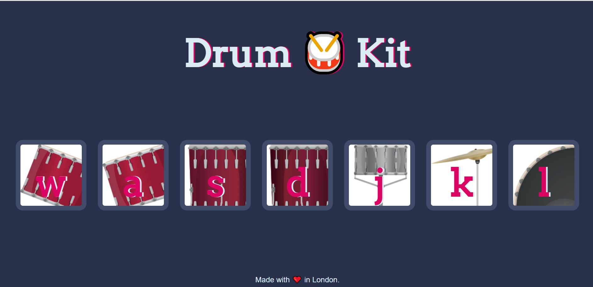

# Drum Kit Challenge 🥁

## Description

A Drum Kit challenge from the  [UDEMY Web Development Course](https://www.udemy.com/course/the-complete-web-development-bootcamp/) ,to aid in understanding the uses of event listeners. Each drum instrument has a keydown and click event attached to themselves.

### Built With

* HTML
* CSS
* JavaScript

## Deployed Website

<https://shanebramble.github.io/drum-kit/>

## Contribution

Made with ❤️ by Shane Bramble-Wade

### ©️2021 Drumkit Challenge, Inc
